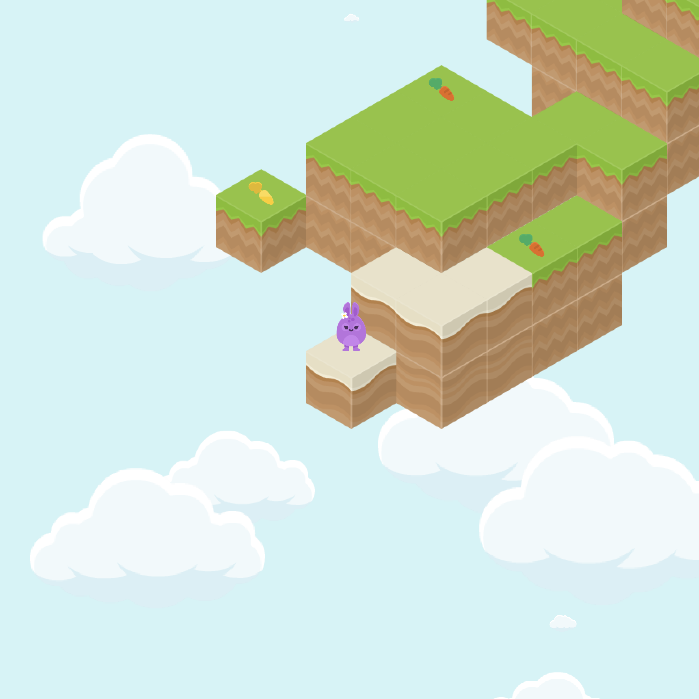

# Bunny Befuddle
An isometric platformer game using Flame in Dart.

Hop around the floating islands and collect carrots. But it's not all that easy when there are optical illusions...

## [Click to play!](https://jakesmd.github.io/Bunny-Befuddle/)
Play in the browser on your computer or smartphone.

## Why?
It's been a long time since I last developed a game, and I'm excited to get back into it. I was just a kid developing games with Kivy in Python when I first discovered Flutter, and I've been developing plain old Flutter apps ever since.

It's time to do and learn something new. I have a whole list of languages and technologies I want to try out, but let's start with Flame. I love Dart, I love Flutter, so it's an easy first choice to get started.

I knew [Kenney Assets](https://kenney.nl/assets) from my Kivy days, and scrolling through them, I came across their isometric assets. Building a 3D-like game using 2D assets sounded like a fun challenge. That's when Bunny Befuddle was born.

So far, my experience with Flame has been pretty good, and I'm enjoying it. I only read the "get started" docs initially and developed a rough isometric game in a couple of hours. That was enough to get me hooked, prompting me to read the docs fully and gain a better understanding of what I was doing wrong, what I was doing right, and what I could do better.

I don't know yet whether to flesh out the game fully or just leave it as a proof of concept and move on to something completely different. We'll see.

## Credits
- Assets by [Kenney](https://kenney.nl/assets)